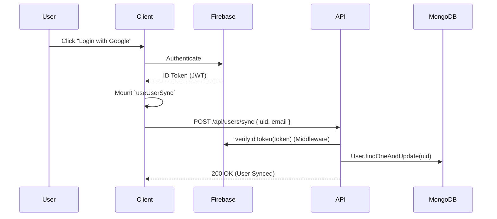

# Zync - System Architecture & Design 🏗️

## 1. High-Level Architecture

Zync operates as a **Real-Time Collaborative Workspace** built on a Three-Tier Architecture, optimized for minimal latency and eventual consistency.

### The Stack
*   **Frontend**: React 18, Vite, TypeScript, Tailwind CSS, Radix UI.
*   **State Management**: 
    *   **Server State**: TanStack Query (v5) for persistent data (Projects, Users).
    *   **UI State**: Context API (Theme) & Local State.
    *   **Auth State**: Firebase Auth SDK + `useUserSync` hook.
*   **Backend**: Node.js, Express.js.
*   **Real-Time**: Socket.io (Signaling/Relay), Firebase Firestore (Chat Persistence).
*   **Database**: 
    *   **MongoDB**: Primary Store (User, Project, Note).
    *   **Prisma/Postgres**: Integration Mirror (GitHub Repos).

---

## 2. Frontend Architecture (`src/`)

The frontend relies on **Side-Effect Hooks** mounted at the root (`App.tsx`) to manage global lifecycle events without complex Context Providers.

### Global Hooks
*   **`useUserSync.ts`**: Listens to `auth.onAuthStateChanged`. On login, it strictly calls `POST /api/users/sync` to ensure the MongoDB User record matches Firebase.
*   **`useActivityTracker.ts`**: Monitors mouse/keyboard events. Pings `PUT /api/sessions/:id` every minute (heartbeat) to track productivity.
*   **`useChatNotifications.ts`**: Subscribes to Firestore snapshots to show "New Message" toasts globally.

### View Structure
| Directory | Responsibility |
| :--- | :--- |
| **`/pages`** | Top-level routing logic (e.g., `Login`, `Dashboard`). |
| **`/components/views`** | The "Heavy" smart components that render feature-specific layouts inside the Dashboard. |
| **`/hooks`** | Business logic encapsulation (Auth sync, Toast triggers). |
| **`/lib`** | Static utilities (`utils.ts`) and Firebase config (`firebase.ts`). |

### Component Map
*   **`DesktopView`**: The Layout Shell (Sidebar + Main Content Area).
*   **`ChatView`**: Handles Firestore subscriptions for messages.
*   **`CalendarView`**: Wraps `react-big-calendar` with Zync Event styles.
*   **`NoteEditor` (BlockNote)**: The collaborative editor instance.

---

## 3. Real-Time Collaboration Logic ⚡

### A. Collaborative Notes (`/notes` namespace)
Zync uses **YJS** (CRDT) over **Socket.io** to enable Google Docs-like editing.

**Protocol:**
1.  **Connection**: Client connects to `ws://host/notes`.
2.  **Room**: Client emits `join-note` with `noteId`.
3.  **Sync**: 
    *   **`note-update`**: Clients send binary YJS updates (Uint8Array). The server **relays** this to other clients in the room (`socket.to(room).emit`).
    *   **`awareness-update`**: Transmits cursor positions and user names/colors.
4.  **Persistence**: The server *does not* decode the binary. Persistence handles via periodic auto-saves to MongoDB (`POST /api/notes`).

### B. Instant Messaging
*   **Mechanism**: Firebase Cloud Firestore (No-SQL Realtime DB).
*   **Why?**: Offloads the complexity of message delivery, offline syncing, and ordering from our Node server.
*   **Flow**: Client writes to `messages/{id}` -> Firestore triggers listeners on other Clients.

---

## 4. Backend Architecture (`backend/`)

### Authentication Flow

### GitHub Sync Engine
Files: `routes/githubAppWebhook.js`, `lib/prisma.js`
1.  **Webhook**: GitHub sends `push` event payload.
2.  **Verification**: HMAC SHA-256 signature check against `GITHUB_WEBHOOK_SECRET`.
3.  **Analysis**: Commits sent to **Groq (Llama3)** to extract semantic Task IDs.
4.  **Update**: 
    *   **Prisma** updates the structured Task record.
    *   **Socket.io** emits `taskUpdated` to frontend.

### Meeting Generation
File: `services/googleMeet.js`
*   Uses a **Server-Side Refresh Token** (Offline Access).
*   Generates `hangoutLink` via `calendar.events.insert`.
*   Does **not** require the active user to have Calendar permissions (The system acts as the host).

---

## 5. Folder & Data Structure

### Data Models (Hybrid)
*   **Mongoose**: `User`, `Project` (with embedded Steps/Tasks), `Note`, `Folder`, `Session`.
*   **Prisma**: `Task`, `Repository` (Used only for GitHub Webhook synchronization efficiency).

### File Uploads
*   **Storage**: Local disk storage (`/uploads`).
*   **Handling**: `multer` middleware processes multipart/form-data.
*   **Security**: File type filtering (Images, PDFs, Docs).
