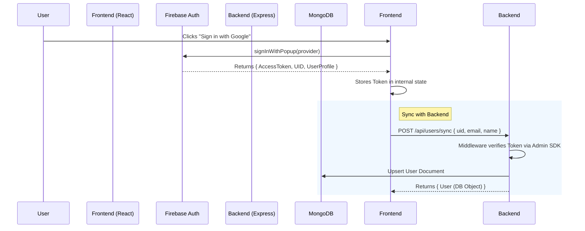
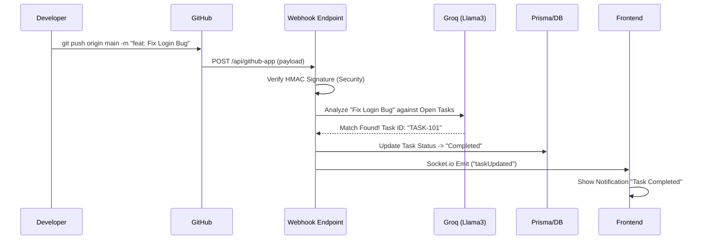

# Zync - System Architecture & Design 🏗️

## 1. High-Level Data Flow

Zync operates as a unified workspace where data flows between three main pillars: **User Interaction** (Frontend), **Data persistence & Logic** (Backend/DB), and **External Integrations** (GitHub/Google).

### The Three-Tier Architecture
1.  **Client Layer (Frontend)**: React 18 SPA. Handles optimistic UI updates and real-time socket events.
2.  **Service Layer (Backend)**: Express.js REST API. Acts as the orchestrator for AI, Auth, and Webhooks.
3.  **Data Layer**:
    *   **MongoDB**: Primary store for Users, Projects, and unstructured Notes.
    *   **Prisma/Postgres**: Used specifically for the GitHub Sync Engine (Repositories/Tasks).
    *   **Redis**: Session storage & global caching.
    *   **Firestore**: Real-time chat message store.

---

## 2. Authentication Flow 🔐

**Goal**: Securely identify users using Firebase while maintaining a custom backend session.

### Diagram

### Technical Detail
1.  **Login (`Login.tsx`)**: Uses `signInWithPopup`. On success, we immediately call `verifyToken`.
2.  **Verification (`middleware/authMiddleware.js`)**:
    *   Intersects every API request.
    *   Extracts `Bearer <token>`.
    *   Calls `admin.auth().verifyIdToken(token)`.
    *   Attaches `req.user.uid` to the request context.

---

## 3. GitHub Integration Flow 🐙

**Goal**: Link Zync Projects to GitHub Repositories and auto-track progress.

### A. OAuth Connection (Linking Account)
1.  **User** clicks "Connect GitHub".
2.  **Frontend** redirects to GitHub OAuth page.
3.  **GitHub** calls back to `/api/github/callback` with a temporary `code`.
4.  **Backend**:
    *   Exchanges `code` for `access_token`.
    *   **Encrypts** the token using AES-256 (`CryptoJS`).
    *   Stores it in `User.integrations.github.accessToken`.

### B. The Sync Engine (Webhooks)

---

## 4. Google Meet Integration 🎥

**File**: `backend/services/googleMeet.js`

This flow is unique because it requires **Offline Access** (server-side generation without user interaction).

1.  **Setup**: The Admin (User) generates a `GOOGLE_REFRESH_TOKEN` via our script `scripts/get-refresh-token.js`. This token allows the backend to act on behalf of the `zync.meet@gmail.com` account forever.
2.  **Request**: Frontend calls `POST /api/meet/invite`.
3.  **Execution**:
    *   Backend initializes `google.auth.OAuth2` with the *Refresh Token*.
    *   It requests a new short-lived *Access Token*.
    *   It calls `calendar.events.insert` with `conferenceDataVersion: 1`.
    *   Google returns a `hangoutLink` (e.g., `meet.google.com/abc-xyz`).
4.  **Delivery**: The link is returned to the Frontend and effectively "injected" into the Chat or Project via Email.

---

## 5. Frontend Architecture (Folder Structure)

Mapping the view components in `src/components/views` to the actual user features:

| Component | Feature / Responsibility |
| :--- | :--- |
| **`DesktopView.tsx`** | **The Main Layout**. Handles the Sidebar navigation, global state layout, and switching between the views below. |
| **`DashboardView.tsx`** | **Home**. Shows "Good Morning", Productivity Chart, Quick Tasks, and Recent Activity. |
| **`MyProjectsView.tsx`** | **Project Hub**. Grid view of all projects. Clicking one opens `ProjectDetails.tsx`. |
| **`ChatView.tsx`** | **Messenger**. The Instagram-style chat interface. Handles real-time message rendering and user list. |
| **`CalendarView.tsx`** | **Schedule**. Renders the `react-big-calendar`. Fetches events from Google Calendar and stored Project deadlines. |
| **`TasksView.tsx`** | **Global Kanban**. Aggregates tasks from *all* projects into a single "To-Do / Doing / Done" board. |
| **`DesignView.tsx`** | **Inspiration**. Connects to Dribbble API to show design shots for inspiration. |
| **`SettingsView.tsx`** | **User Config**. Profile update, Notifications toggle, GitHub Connect/Disconnect controls. |

---

## 6. AI Agent Flow (Project Generation)

**File**: `backend/routes/generateProjectRoutes.js`

1.  **Prompt Engineering**: User input ("I want a refined E-commerce app") is wrapped in a "Senior Architect" system prompt.
2.  **Inference**: Sent to Google Gemini Pro model.
3.  **Structured Output**: The AI is forced to return valid JSON containing:
    *   `architecture`: High-level tech stack explanations.
    *   `steps`: An array of Phases (Frontend, Backend, DB).
    *   `tasks`: Granular action items for each phase.
4.  **Hydration**: This JSON is mapped directly to the Mongoose `Project` schema and saved.
