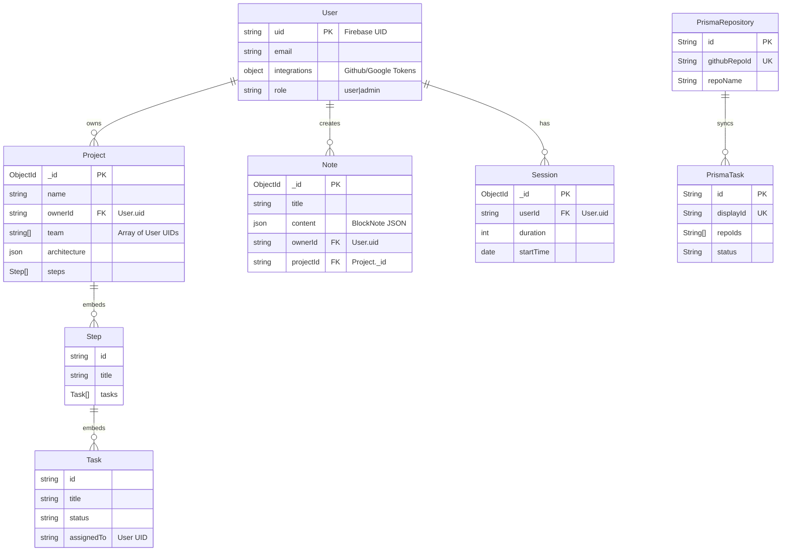

# Backend Architecture Audit Report

## 1. Prisma Audit: **CONFIRMED USE** ⚠️

Documentation that states Zync is "Strictly Mongoose/MongoDB" is **INCORRECT**.

The project uses a **Hybrid Database Architecture**:
1.  **MongoDB (via Mongoose)**: This is the primary database for Users, Projects, Notes, and Sessions.
2.  **MongoDB (via Prisma/Postgres Adapter?)**: The project contains a `schema.prisma` file, and `prisma` is actively used in the **GitHub Sync Engine** (`githubAppWebhook.js`) and **Task Synchronization** (`linkRoutes.js`).

**Evidence:**
-   `backend/prisma/schema.prisma` exists.
-   `backend/lib/prisma.js` initializes the client.
-   `backend/routes/githubAppWebhook.js` imports `prisma` and performs `upsert` on `Repository` and `update` on `Task`.

**architectural Note**: It appears `Prisma` is being used to mirror or handle specific relational data (like GitHub Repo <-> Task mappings) that might require SQL-like consistency or was part of a specific feature implementation, while the core app uses Mongoose.

---

## 2. Project Creation Logic

The AI Project Generation flow is handled by **Mongoose**.

**Endpoint**: `POST /api/generate-project`
**File**: `backend/routes/generateProjectRoutes.js`
**Frontend Call**: `CreateProject.tsx` calls `${API_BASE_URL}/api/generate-project`.

**Step-by-Step Flow:**
1.  **Request**: Receives `{ name, description, ownerId }`.
2.  **AI Inference**: Calls `GoogleGenerativeAI` (Gemini Model: `gemini-2.0-flash-exp`) with a system prompt to return a JSON structure.
3.  **Parsing**: The text response is parsed into a JSON object (`generatedData`).
4.  **Transformation**: The AI's `steps` array is mapped to match the Mongoose sub-document schema.
5.  **Persistence (Mongoose)**:
    ```javascript
    // Line 103 in generateProjectRoutes.js
    const newProject = new Project({
      name,
      description,
      ownerId: ownerId || 'anonymous',
      architecture: generatedData.architecture || {},
      steps: steps, // Mapped array
      team: []
    });

    await newProject.save(); // Saves to MongoDB
    ```
6.  **Response**: Returns the fully created MongoDB document.

*Conclusion*: Project generation **strictly uses Mongoose**. Prisma is NOT involved in this specific flow.

---

## 3. Entity Relationship Diagram (ERD)

Based on `backend/models/*.js` (Mongoose) and `backend/prisma/schema.prisma` (Prisma).



### Key Observation on Data Duplication
There is an overlap between the **Embedded Tasks** in `Project` (Mongoose) and the **PrismaTask** model. The `githubAppWebhook.js` updates tasks via Prisma using `displayId`. This suggests a potential synchronization challenge where updates in one DB (Prisma - via Webhook) need to reflect in the other (Mongoose - via UI).
