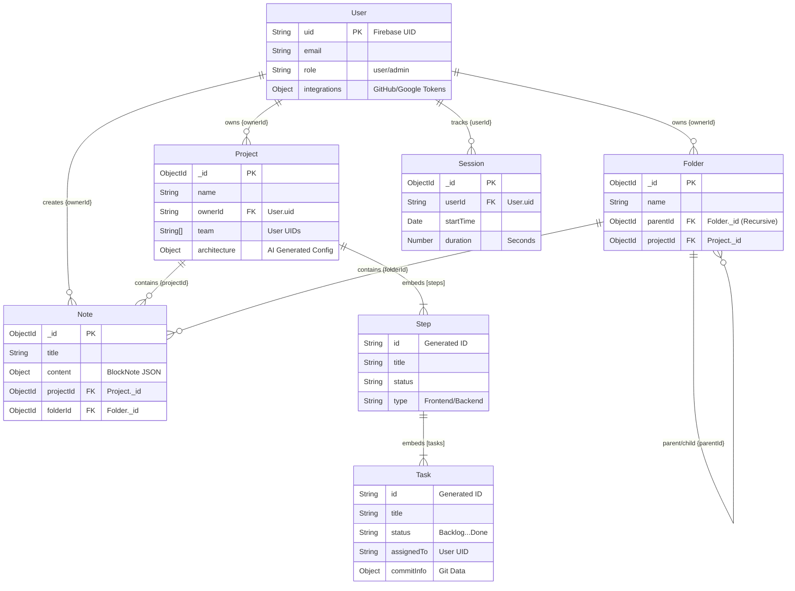

# Reverse Engineered Entity Relationship Diagram (ERD) 🛠️

> **Source**: `backend/models/*.js`
> **Method**: Static analysis of Mongoose Schemas.

## 1. Mongoose ERD (Mermaid.js)



## 2. Key Findings

### A. Strict Mongoose Relationships (Hybrid Refs)
Your database uses a hybrid approach to relationships:
1.  **Hard References (`ObjectId`)**: Used for `Notes`, `Folders`, and `Projects`. This allows population (`.populate('folderId')`).
2.  **Soft References (`String UID`)**: Used for **Users**. The `User` model is identified by the Firebase `uid` (String), not a MongoDB `_id`. Therefore, `Project.ownerId`, `Note.ownerId`, and `Task.assignedTo` store strings, not ObjectIds. **You cannot use standard Mongoose `.populate('ownerId')` here.** You must manually query the User collection.

### B. Embedded vs. Referenced Tasks
*   **Tasks are EMBEDDED**: `Tasks` do **not** have their own Collection. They exist only inside the `steps` array of a `Project` document.
*   **Implication**: To update a task, you must find the Project first, then traverse the arrays:
    ```javascript
    Project.findOneAndUpdate(
      { "_id": pid, "steps.tasks._id": tid }, 
      { $set: { "steps.$[s].tasks.$[t].status": "Done" } } ...
    )
    ```

### C. Missing Entities (External Data)
*   **Chat Messages**: No `Message` model was found. Based on your codebase, these are stored in **Firebase Firestore** (`chats` / `messages` collections) for real-time performance.
