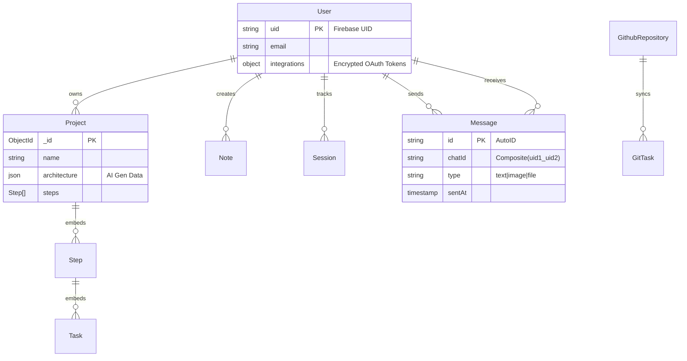

# System Entity Relationship Diagram (ERD) 🗄️

This document serves as the **Single Source of Truth** for the Zync Data Architecture.
It covers the Hybrid Database system (MongoDB + Postgres + Firestore + Redis).

## 1. High-Level Data Model

---

## 2. NoSQL Document Schemas (Mongoose)

### `User` Collection
| Field | Type | Description |
| :--- | :--- | :--- |
| `uid` | String (Index) | **Primary Key**. Firebase User ID. |
| `email` | String | User email. |
| `integrations.github` | Object | `{ accessToken (Encrypted), username, installationId }` |
| `integrations.google` | Object | `{ refresh_token }` |
| `role` | String | `user` or `admin`. |

### `Project` Collection
| Field | Type | Description |
| :--- | :--- | :--- |
| `_id` | ObjectId | **Primary Key**. |
| `ownerId` | String | FK to `User.uid`. |
| `steps` | Array | List of phases (e.g., "Phase 1: Frontend"). |
| `steps[].tasks` | Array | **Embedded** Task objects. |
| `githubRepoIds` | String[] | Linked GitHub Repository IDs. |

### `Note` Collection
| Field | Type | Description |
| :--- | :--- | :--- |
| `_id` | ObjectId | **Primary Key**. |
| `content` | JSON | **BlockNote** compatible JSON structure. |
| `folderId` | ObjectId | FK to `Folder` (Nullable). |
| `projectId` | ObjectId | FK to `Project` (Nullable). |

---

## 3. Relational Schema (Prisma/Postgres)

**Purpose**: Used strictly by the **GitHub Sync Engine** to map Git commits to Tasks efficiently without parsing deep JSON trees in MongoDB.

### `Task` Table
| Field | Type | Description |
| :--- | :--- | :--- |
| `id` | String (PK) | Mongo ObjectId string. |
| `displayId` | String | Human readable ID (e.g., `TASK-101`). |
| `repoIds` | String[] | Array of associated GitHub Repo IDs. |
| `status` | String | `pending`, `completed`. |

### `Repository` Table
| Field | Type | Description |
| :--- | :--- | :--- |
| `id` | String (PK) | Mongo ObjectId string. |
| `githubRepoId` | String (Unique)| The actual numeric ID from GitHub API. |
| `repoName` | String | e.g., `owner/repo-name`. |

---

## 4. Real-Time Data (Firestore)

**Purpose**: Stores chat history and drives real-time messaging updates.

### `messages` Collection
| Field | Type | Description |
| :--- | :--- | :--- |
| `chatId` | String | Composite key: `Sort([uid1, uid2]).join('_')`. |
| `senderId` | String | User UID. |
| `receiverId` | String | User UID. |
| `text` | String | Message content. |
| `type` | String | `text`, `image`, `file`, `project-invite`. |
| `fileUrl` | String | Path to uploaded file (for `image`/`file`). |
| `timestamp` | ServerTimestamp | Processing time. |
| `seen` | Boolean | Read receipt status. |

---

## 5. Caching & Session (Redis)
*   **Usage**: `connect-redis` session store.
*   **Key Pattern**: `sess:{session_id}`.
*   **TTL**: Defined by `express-session` config (default 1 day).
