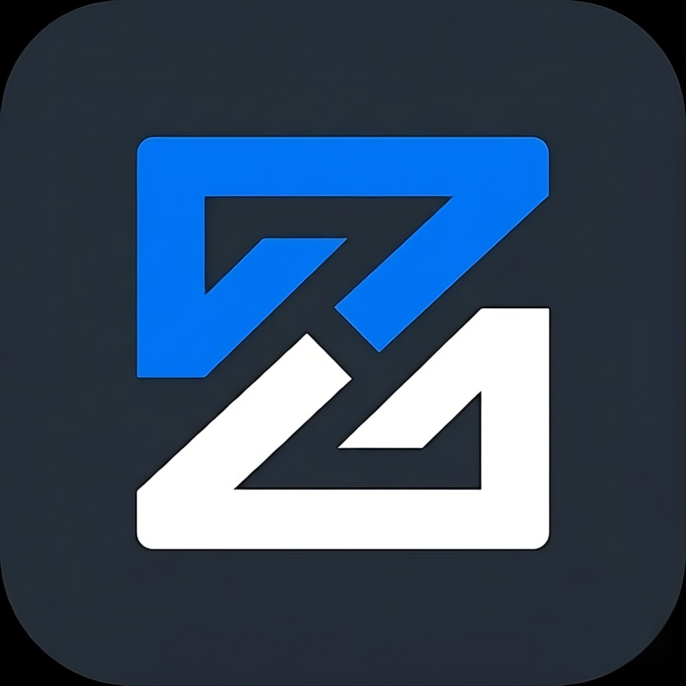
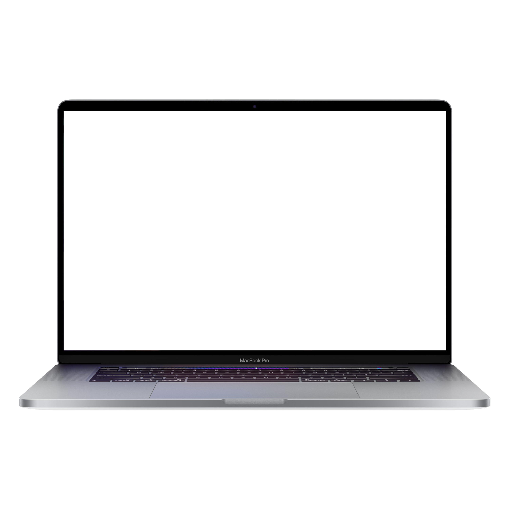

<div align="center">
  <picture>
    <source media="(prefers-color-scheme: dark)" srcset="public/zync-dark.webp">
    <source media="(prefers-color-scheme: light)" srcset="public/zync-white.webp">
    
  </picture>
  
  <h1>Zync</h1>
  <p><b>An open-source, AI-native collaborative workspace. Plan, design, and write together in real-time.</b></p>
  
  <p>
    <a href="https://zync-meet.vercel.app">Live App</a> •
    <a href="https://github.com/zync-meet/Zync/discussions">Discussions</a> •
    <a href="https://github.com/zync-meet/Zync/tree/main/docs">Documentation</a> •
    <a href="mailto:consolemaster.app@gmail.com">Contact</a>
  </p>

  <p>
    <a href="https://github.com/zync-meet/Zync/stargazers"></a>
    <a href="https://github.com/zync-meet/Zync/network/members"></a>
    <a href="https://github.com/zync-meet/Zync/blob/main/LICENSE"></a>
    <a href="https://github.com/zync-meet/Zync/issues?q=is%3Aissue+is%3Aopen+label%3A%22good+first+issue%22"></a>
    <a href="https://github.com/zync-meet/Zync/actions/workflows/build.yml"></a>
  </p>

  <br />
  <a href="https://zync-meet.vercel.app"></a>
</div>

<br/>

## 📖 What is Zync?

Modern teams are forced to fragment their workflows across five different apps: one for whiteboarding, one for docs, one for tasks, and another for AI generation. 

**Zync is an open-source, all-in-one workspace.** We merge real-time document editing, visual canvasing, and project management into a single, local-first platform. Unlike other tools, Zync is supercharged by multi-modal AI from the ground up to automate the busywork of project management. 

Your data, your servers, your workflow. Zync is built to be a better, open-source alternative to tools like Notion, Miro, and Linear.

---

## ✨ Core Features

### 📝 The Hyper-Fused Editor
Many productivity apps claim to be a canvas, but Zync actually merges the doc and the whiteboard. Our flexible block-based architecture allows you to drop rich text, sticky notes, embedded web pages, multi-view databases, and shapes onto a limitless, edgeless canvas.

### 🤖 Multimodal AI Partner
Zync integrates deeply with **Google Gemini** and **Groq** to act as your AI co-pilot. 
- **Project Architect:** Instantly turn a rough outline into a structured project plan with tasks and deliverables.
- **Design Inspiration:** Generate UI/UX layouts and styling ideas directly onto your canvas.
- **Content Generation:** Summarize long meetings, draft professional reports, or write code snippets with a single prompt.

### ⚡️ Zero-Latency Real-Time Sync
We love the "local-first" philosophy. Zync utilizes **Yjs** (a high-performance CRDT implementation) and **WebSockets** to ensure that whether you are working solo offline or collaborating with 50 people in real-time, your data syncs instantly without conflicts.

### 🔄 Kanban & GitHub Sync
Don't duplicate your work. Zync features a built-in Kanban board that bidirectionally syncs with GitHub Issues and Projects. Move a card in Zync, and watch the issue update on GitHub.

### 💬 Embedded Instant Chat
Stop context-switching to Slack or Discord. Zync features low-latency WebSockets communication embedded directly into your workspace, allowing teams to chat contextually right next to the canvas they are editing.

---

## 🆚 Why Zync? (Comparison)

| Feature | Zync | Notion | Miro |
|:---|:---:|:---:|:---:|
| **Open Source** | 🟢 Yes | 🔴 No | 🔴 No |
| **Self-Hostable** | 🟢 Yes | 🔴 No | 🔴 No |
| **Local-First & Offline** | 🟢 Yes | 🔴 No | 🟡 Limited |
| **Native AI Workflows** | 🟢 Deeply Integrated | 🟡 Paid Add-on | 🟡 Paid Add-on |
| **Edgeless Canvas + Docs** | 🟢 Fully Merged | 🔴 Docs Only | 🔴 Canvas Only |
| **GitHub Bidirectional Sync** | 🟢 Yes | 🟡 Third-party | 🔴 No |

---

## 🏗️ Architecture & How It Works

Zync is built using enterprise-grade, modern open-source tools:

- **Frontend**: A blazing fast Single Page Application built with **React**, **Vite**, and **TailwindCSS**. State is managed via **React Query** and **Jotai**.
- **Real-Time Engine**: Built on **Yjs** for conflict-free replicated data types (CRDTs), ensuring all clients stay perfectly in sync. **Socket.IO** handles the bidirectional transport layer.
- **Backend**: A robust **Node.js/Express** API that handles authentication, REST endpoints, and orchestration.
- **Database Layer**: **Prisma** handles complex relational data, while **MongoDB (Mongoose)** manages unstructured document data. **Redis** acts as our high-performance pub/sub and caching layer.
- **AI Engine**: LangChain-powered orchestration hooking into **Gemini** and **Groq** APIs.

---

## 🚀 Quick Start (Local Development)

Getting Zync running locally takes less than 30 seconds thanks to our automated workspace hooks.

Setting up Zync locally is completely frictionless. Our `postinstall` hooks handle the backend dependencies automatically.

```bash
# 1. Clone the repository
git clone https://github.com/zync-meet/Zync.git
cd Zync

# 2. Install ALL dependencies (Frontend & Backend via postinstall)
npm install

# 3. Setup Environment Variables
cp .env.example .env
cp backend/.env.example backend/.env

# 4. Start the Application
npm run dev
```

*The Frontend will be running at `http://localhost:5173` | The Backend API will be running at `http://localhost:8081`*

---

## ☁️ Self-Hosting & Deployment

Take full control of your data. Zync is designed to be easily deployed on your own infrastructure.

### Managed Cloud (Vercel & Render)
Zync includes out-of-the-box configuration files for one-click deployments:
- **Frontend**: Deploy instantly via `vercel.json` on [Vercel](https://vercel.com).
- **Backend**: Deploy as a Web Service via `render.yaml` on [Render](https://render.com).

### Oracle Cloud / Terraform
For enterprise scale, we provide complete Terraform scripts to provision a highly-available Zync cluster on Oracle Cloud Infrastructure (OCI). See our [Oracle VM Setup Guide](docs/guides/ORACLE_VM_SETUP.md).

---

## 🤝 Ecosystem & Upstreams

Zync stands on the shoulders of open-source giants. We extend our deepest gratitude to:
* **[Yjs](https://yjs.dev/)**: The fundamental CRDT engine powering our real-time state management.
* **[React](https://react.dev/) & [Vite](https://vitejs.dev/)**: For a blazing fast, component-driven frontend.
* **[Socket.IO](https://socket.io/)**: Enabling low-latency, bidirectional communication.
* **[Prisma](https://www.prisma.io/) & [MongoDB](https://www.mongodb.com/)**: Our robust database ORM and storage layer.

---

## 📚 Documentation

Dive deeper into Zync's internals by exploring our comprehensive documentation in the `docs/` folder:

**Architecture & Design**
- 🏗️ [Tech Stack Overview](docs/architecture/tech_stack_overview.md)
- 🧠 [AI Project Architect](docs/architecture/ai_project_architect.md)
- 🔒 [Security & Auth Architecture](docs/architecture/security_and_auth_architecture.md)
- ⚡️ [Performance Strategy](docs/architecture/performance_and_caching_strategy.md)

**Guides & Audits**
- 🚀 [Performance Audit](docs/audit/PERFORMANCE_AUDIT.md)
- 🔑 [LinkedIn Login Guide](docs/guides/LINKEDIN_LOGIN_GUIDE.md)
- ☁️ [Oracle VM Setup](docs/guides/ORACLE_VM_SETUP.md)

---

## 🗺️ Roadmap

- [x] Hyper-fused Markdown + Canvas Editor
- [x] Real-time CRDT Sync
- [x] Gemini AI Integrations
- [x] GitHub Kanban Bidirectional Sync
- [ ] Desktop App (Electron/Tauri)
- [ ] End-to-End Encryption (E2EE) for Workspaces
- [ ] Plugin System for Custom AI Agents
- [ ] Mobile App (React Native)

---

## 👥 Meet the Founders

Zync is proudly built and maintained by:

| [](https://github.com/chitkullakshya) | [](https://github.com/prem22k) | [](https://github.com/eesha264) | [](https://github.com/thanmayeereddykotha) |
|:---:|:---:|:---:|:---:|
| **[Lakshya Chitkul](https://github.com/chitkullakshya)** | **[Prem Sai Kota](https://github.com/prem22k)** | **[Eeshitha Gone](https://github.com/eesha264)** | **[Thanmayee Reddy Kotha](https://github.com/thanmayeereddykotha)** |

---

## 💖 Contributing

We are building a vibrant, open-source community and we'd love for you to join us! Whether you are fixing a typo, optimizing a query, or building a massive new feature, all contributions are celebrated.

1. Read our [Contributing Guide](docs/CONTRIBUTING.md) to understand our workflow.
2. Review our [Contribution Workflow](docs/guides/contribution_workflow.md).
3. Check out our [Issues Board](https://github.com/zync-meet/Zync/issues) and look for issues labeled `good first issue`.
4. Reach out via email at [consolemaster.app@gmail.com](mailto:consolemaster.app@gmail.com) or start a [GitHub Discussion](https://github.com/zync-meet/Zync/discussions) to get help.

---

## 📜 License

Zync is open-source software licensed under the [MIT License](LICENSE).
