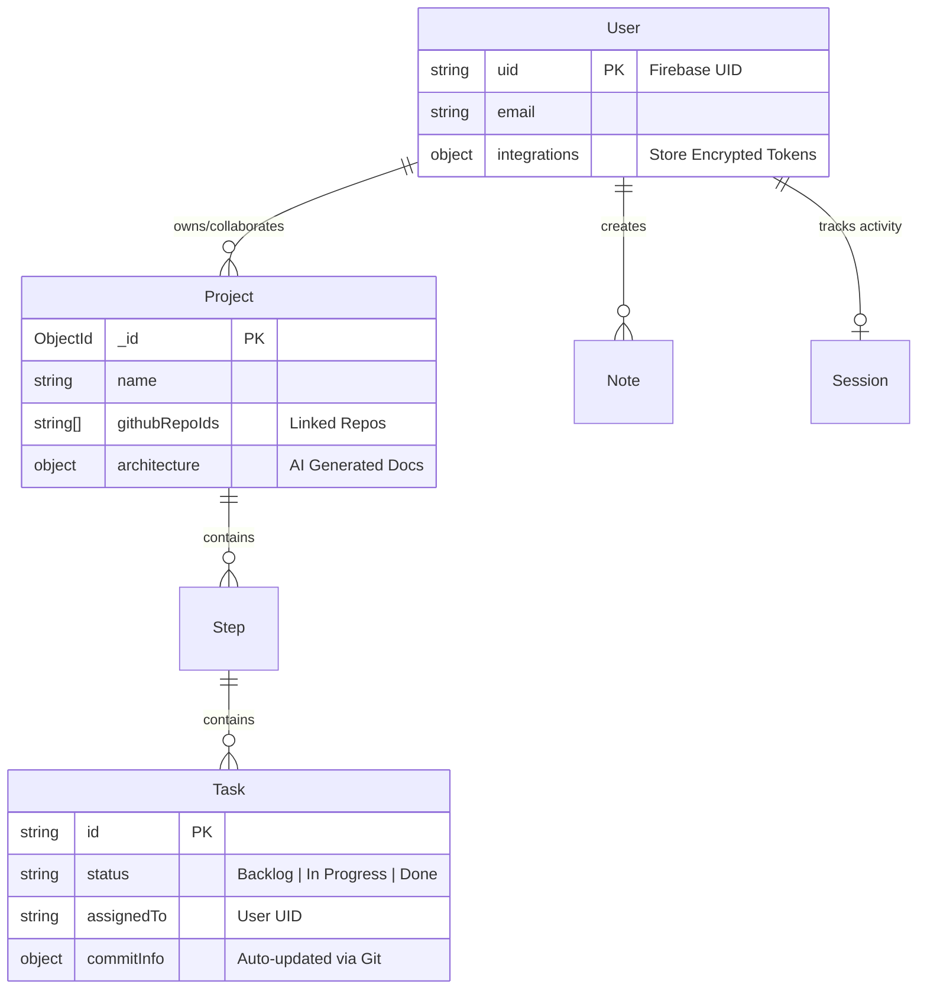

# Zync ⚡

   
> **The Intelligent All-in-One Workspace for Teams and Developers.**

Zync is a production-grade collaboration platform designed to unify project management, real-time communication, and developer workflows. It distinguishes itself by integrating **AI agents** for project planning and **automated git operations** for task tracking, bridging the gap between planning (Jira/Linear) and execution (GitHub).

---

## 📚 Internal Documentation

For deep-dives into specific systems, refer to our internal specs:

- **[API Reference (`API.md`)](./API.md)**: Detailed endpoint documentation (Auth, Payloads, Responses).
- **[System Architecture (`ARCHITECTURE.md`)](./ARCHITECTURE.md)**: Data flows, View-Controller mappings, and Meeting Logic diagrams.
- **[Database Schema (`ERD.md`)](./ERD.md)**: Reverse-engineered Entity Relationship Diagram (Mongoose & Prisma).
- **[System Audit (`AUDIT.md`)](./AUDIT.md)**: A technical audit of the hybrid database architecture and AI logic.
- **[Design Setup (`DRIBBBLE_SETUP.md`)](./DRIBBBLE_SETUP.md)**: Configuration guide for Unsplash, Pinterest, and Behance integrations.

---

## 🛠️ Deep-Dive Tech Stack

### Frontend Architecture (`src/`)
*   **Core Framework**: [React 18](https://react.dev/) with [TypeScript](https://www.typescriptlang.org/) and built via [Vite](https://vitejs.dev/) for high-performance HMR.
*   **State Management**:
    *   **TanStack Query (v5)**: For server state management, caching, and optimistic updates.
    *   **Context API**: For global UI state (Theme, Auth User).
*   **Real-Time & Collaboration**:
    *   **Socket.io Client**: For instant signaling and live updates.
    *   **Firebase Firestore**: Used as the backing store for the Chat system to ensure message persistence and offline support.
    *   **YJS**: Integrated with [BlockNote](https://www.blocknotejs.org/) for eventually consistent collaborative rich-text editing.
*   **UI System**: [Tailwind CSS](https://tailwindcss.com/) combined with [Radix UI](https://www.radix-ui.com/) primitives for accessible, unstyled components.

### Backend Architecture (`backend/`)
*   **Runtime**: Node.js with Express.js.
*   **Databases (Hybrid Approach)**:
    *   **MongoDB (via Mongoose)**: Primary document store for unstructured data like Users, Project Plans, and Notes.
    *   **PostgreSQL (via Prisma)**: Used specifically for the **GitHub Sync Engine** to handle structured relational data (Repositories, Task mappings) efficiently.
    *   **Redis**: High-speed session store and caching layer for frequent read operations.
*   **Authentication**:
    *   **Firebase Admin SDK**: Handles ID token verification. We offload identity management to Firebase but sync user profiles to our MongoDB `users` collection.
*   **Background Processing**:
    *   **Webhooks**: Dedicated endpoints for GitHub App events (`push`, `pull_request`).
    *   **Nodemailer**: Custom OAuth2 transport for sending transactional emails via Gmail API.

---

## �️ System Architecture & Schema

### Data Relationships (Text-based ERD)



### Key Schemas
1.  **User (`models/User.js`)**: Acts as the central identity. Crucially, it stores **encrypted** OAuth tokens for GitHub (`integrations.github.accessToken`) and Google to allow API actions on behalf of the user.
2.  **Project (`models/Project.js`)**: Uses an **Embedded Document Pattern** for `Steps` and `Tasks`. This allows for atomic updates and ensures the entire project plan is loaded in a single query, which is efficient for the Dashboard view.

---

## � Key Features Implementation

### 1. GitHub Bi-Directional Sync
**The Problem**: Developers hate manually moving Jira tickets.
**Our Solution**: We listen to actual code changes.
*   **Auth**: Users authenticate via OAuth2 (`routes/github.js`). We exchange the code for an Access Token, **encrypt it using AES**, and store it in MongoDB.
*   **Sync Engine**:
    *   We use a **GitHub App Webhook** (`routes/githubAppWebhook.js`) to listen for `push` events.
    *   **Signature Verification**: Every payload is verified against `GITHUB_WEBHOOK_SECRET` using HMAC SHA-256 to prevent spoofing.
    *   **AI Analysis**: The commit message is sent to **Groq/Llama3**, which parses it to find semantic matches to existing tasks (e.g., "fix login bug" -> matches Task "Fix Auth").
    *   **Auto-Complete**: If a match is found, the system automatically marks the Task as `Completed` in the database and creates a real-time `taskUpdated` event via Socket.io.

### 2. Instant Google Meet
*   **Flow**: User clicks "Create Meeting" -> Frontend calls API.
*   **Backend**: 
    1.  Uses a pre-authorized `GOOGLE_REFRESH_TOKEN` (Server-side offline access).
    2.  Refreshes the Access Token via `googleapis` Auth client.
    3.  Calls `calendar.events.insert` with `conferenceDataVersion: 1`.
    4.  Returns the generated `hangoutLink` immediately to the chat.

### 3. AI Project Generation
*   **Input**: User types "I want a Netflix clone."
*   **Process**:
    1.  Prompt Engineering: We wrap this input in a "System Architect" persona prompt.
    2.  LLM Call: Sent to Google Gemini 2.5 Flash.
    3.  JSON Parsing: The AI returns a structured JSON object containing Phases (Frontend/Backend) and specific actionable Tasks.
4.  Persistence: This JSON is hydrated into the `Project` Mongoose model and saved.

### 4. Design Inspiration Engine
*   **Sources**: Aggregates creative work from **Unsplash**, **Pinterest**, and **Behance**.
*   **Mechanism**: Uses official APIs (Pinterest/Unsplash) and RSS feeds (Behance) to create a unified searchable feed for localized design research without leaving the app.

---

## ⚙️ Environment Setup

Combine these variables into your `.env` files.

### 1. Backend (`backend/.env`)

| Variable | Description |
| :--- | :--- |
| **Database** | |
| `MONGO_URI` | Connection string for MongoDB Atlas/Local |
| `REDIS_URL` | Redis connection (default: `redis://localhost:6379`) |
| **Auth & Security** | |
| `ENCRYPTION_KEY` | Random string (32 chars) to encrypt OAuth tokens |
| `GOOGLE_REFRESH_TOKEN` | **Critical**: Run `node scripts/get-refresh-token.js` to get this |
| `GCP_SERVICE_ACCOUNT_KEY`| JSON string of Firebase Admin Service Account |
| **Integrations** | |
| `GITHUB_APP_ID` | From GitHub App Settings |
| `GITHUB_PRIVATE_KEY` | PEM format key for GitHub App (use `\n` for newlines) |
| `GITHUB_WEBHOOK_SECRET` | Secret you set in GitHub Webhook settings |
| `GEMINI_API_KEY` | Google AI Studio Key |
| `GROQ_API_KEY` | Groq Cloud Key |
| `UNSPLASH_ACCESS_KEY` | Unsplash Client ID for image search |
| `PINTEREST_TOKEN` | Pinterest User Access Token (Bearer) |
| `PINTEREST_BOARD_ID` | Specific board ID to fetch pins from |

### 2. Frontend (`.env`)

| Variable | Description |
| :--- | :--- |
| `VITE_API_URL` | `http://localhost:5000` (or your production URL) |
| `VITE_FIREBASE_Config` | All standard Firebase SDK keys (`API_KEY`, `AUTH_DOMAIN`, etc.) |

---

## � Running the Project

1.  **Install Dependencies**
    ```bash
    npm install         # Frontend
    cd backend && npm install
    ```

2.  **Refresh Token Setup (First Run Only)**
    To enable Calendar/Mail features, you must generate a user-scoped refresh token:
    ```bash
    cd backend
    node scripts/get-refresh-token.js
    # Follow on-screen instructions and update backend/.env
    ```

3.  **Start Dev Servers**
    *   Backend: `cd backend && npm run dev`
    *   Frontend: `npm run dev`

---

## 📄 License
MIT License.

---

## 👥 Contributors

This project was architected and built by:

*   **Chitkul Lakshya** ([@ChitkulLakshya](https://github.com/ChitkulLakshya))
*   **Prem Sai Kota** ([@prem22k](https://github.com/prem22k))
