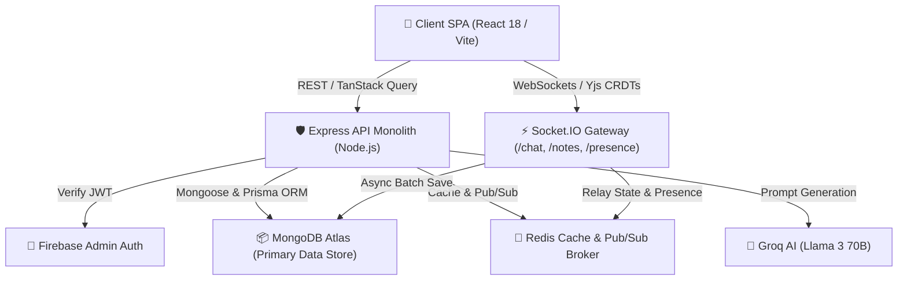

# 🏛️ Zync System Architecture & Master Index

Zync is an enterprise-grade, real-time collaborative workspace platform engineered for asynchronous software teams, AI-driven project management, and conflict-free multi-user authoring.

This master document provides a high-level architectural overview of the platform and serves as the definitive index linking to specialized technical specifications across the repository. All documentation is verified 100% accurate against codebase implementations.

---

## 🗺️ Architecture Documentation Sitemap

To avoid redundancy and maintain a single source of truth, detailed specifications are modularized into dedicated documents:

### Core Infrastructure & Security
* [Tech Stack Overview](file:///home/premsaik/Desktop/Projects/Zync/docs/architecture/tech_stack_overview.md): Comprehensive breakdown of frontend frameworks (React 18, Vite, Tailwind CSS v4), backend server layers (Express 5, Zod), dual ORM database architecture (Prisma + Mongoose), and third-party SDKs.
* [Security & Auth Architecture](file:///home/premsaik/Desktop/Projects/Zync/docs/architecture/security_and_auth_architecture.md): Detailed implementation of identity management via Firebase Admin Auth, HTTP security headers (`helmet`), API rate limiting (`express-rate-limit`), and HMAC SHA-256 webhook validation.
* [Performance & Caching Strategy](file:///home/premsaik/Desktop/Projects/Zync/docs/architecture/performance_and_caching_strategy.md): Deep-dive into distributed Redis caching tiers, TanStack Query client persisters, database connection pooling, and WebSocket load shedding.

### Specialized AI & Collaboration Subsystems
* [AI Project Architect](file:///home/premsaik/Desktop/Projects/Zync/docs/architecture/ai_project_architect.md): Architecture of natural language project generation using Groq Llama 3 SDK and Mongoose bulk operations.
* [Real-Time Notes Editor](file:///home/premsaik/Desktop/Projects/Zync/docs/architecture/realtime_notes_editor.md): CRDT collaboration engine utilizing Yjs binary state relay over Socket.IO (`/notes` namespace) and BlockNote rich text canvas.
* [Instant Chat Messaging System](file:///home/premsaik/Desktop/Projects/Zync/docs/architecture/instant_chat_system.md): High-throughput real-time messaging engine hosted on Socket.IO (`/chat` namespace) backed by MongoDB.
* [Kanban Board & GitHub Sync](file:///home/premsaik/Desktop/Projects/Zync/docs/architecture/kanban_github_sync.md): Bidirectional synchronization pipeline linking drag-and-drop Kanban state to GitHub repository commits and PRs.
* [Design Inspiration Service](file:///home/premsaik/Desktop/Projects/Zync/docs/architecture/design_inspiration_service.md): Stealth web scraping aggregation pipeline utilizing Puppeteer Extra and Redis caching.

---

## 🏗️ High-Level System Design

### 1. Three-Tier Topology
1. **Presentation Layer (Local-First Client)**: Built on React 18 and Vite. UI state is managed via TanStack Query for asynchronous HTTP requests and Yjs/Dexie IndexedDB for local-first CRDT document persistence.
2. **Application Orchestration Layer (Express API & Socket Gateway)**: A unified Node.js monolith exposing traditional REST endpoints protected by robust Zod validation middleware alongside multi-namespaced WebSocket handlers (`/chat`, `/notes`, `/tasks`).
3. **Persisted Data & Caching Layer**: Pure MongoDB dual-ORM architecture (Prisma for relational project hierarchies, Mongoose for flexible chat and document structures) accelerated by an in-memory Redis cluster.

### 2. Contact & Support Routing
All automated system notifications, error reports, security vulnerability disclosures, and user support requests are routed strictly through email to **consolemaster@gmail.com**. No secondary contact addresses or legacy domains are active within the system.

---

## 📐 Key Architectural Patterns

### Single Source of Truth (Thin-Auth Identity)
Rather than splitting user profile data between external auth providers and application databases, Zync implements a "Thin-Auth" synchronization pattern. Firebase Authentication handles OAuth token exchanges and credential security on the client. Upon successful authentication, the client invokes `POST /api/users/sync`, where backend middleware verifies the Firebase JWT via `admin.auth().verifyIdToken()` and upserts the master user record directly into MongoDB.

### CRDT State Relay over Binary WebSockets
Collaborative document authoring decouples document rendering from backend database schema updates. Clients transmit compressed `Uint8Array` Yjs update vectors over Socket.IO. The backend gateway relays these binary payloads directly to peer clients in the active room without decoding them, minimizing CPU overhead. Persistence is handled asynchronously via debounced snapshots written to MongoDB.
