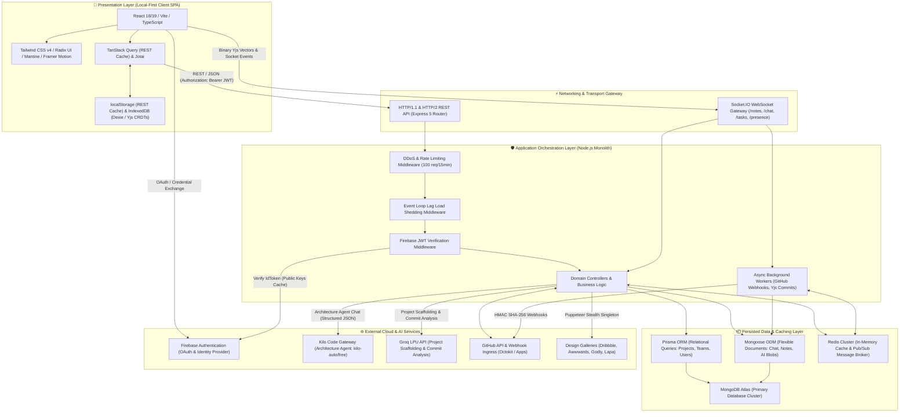
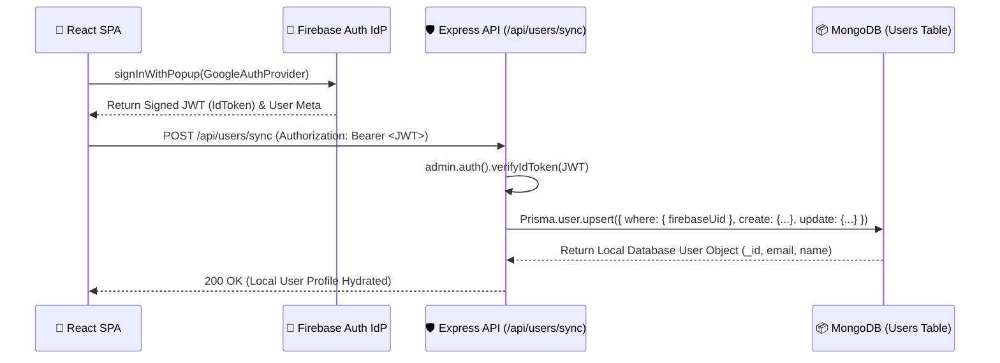
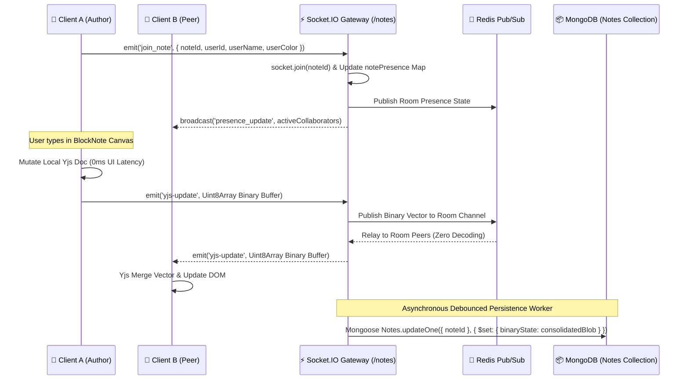
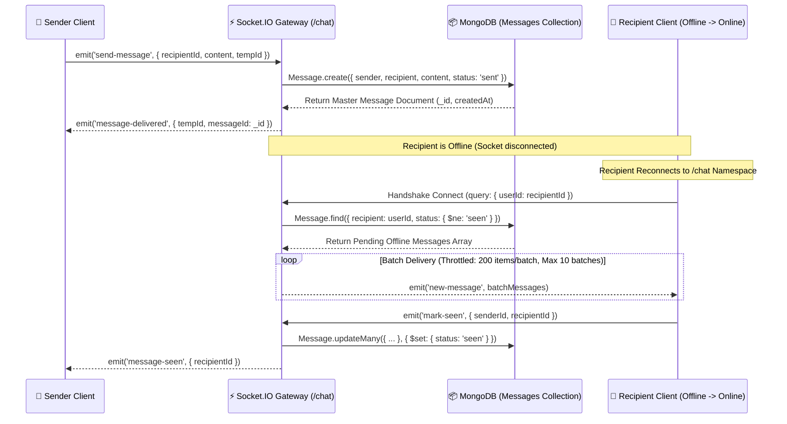
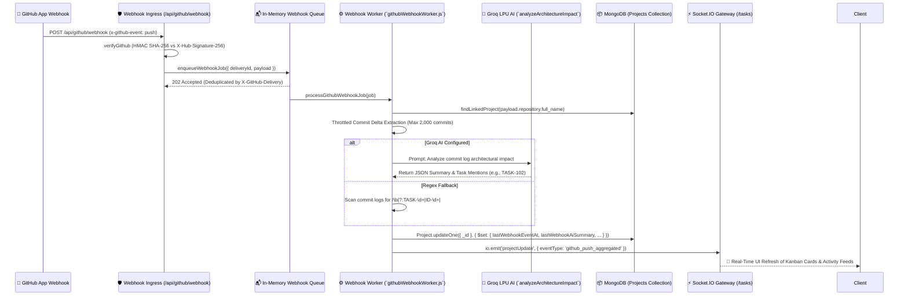

# 🏛️ Zync System Architecture & Master Specification

**Version:** 2026.2  
**Status:** Production Verified & Codebase Fact-Checked  
**Primary Maintainers:** ZYNC Team (`consolemaster.app@gmail.com`)  

---

## 📖 1. Executive Summary & Architectural Philosophy

Zync is an enterprise-grade, local-first collaborative workspace platform engineered for asynchronous software teams, AI-driven project management, and conflict-free multi-user document authoring. Unlike fragmented productivity suites that silo visual whiteboarding, rich text authoring, task boards, and artificial intelligence into disparate applications, Zync unifies these capabilities into a single, high-performance web platform.

The architectural philosophy of Zync is built upon five foundational pillars:
1. **Local-First & Offline Resilience:** User interface rendering and document editing must never block on network latency. By leveraging local browser storage (**IndexedDB** via **Dexie** and **localStorage** via **TanStack Query Persister**), users can launch workspaces and edit rich-text canvases offline, with deterministic synchronization occurring seamlessly upon network restoration.
2. **Decentralized Conflict Resolution (CRDTs):** Collaborative authoring abandons centralized server-locking and Operational Transformation (OT) in favor of **Conflict-free Replicated Data Types (Yjs)**. State updates are exchanged as compressed binary vectors over low-latency WebSockets.
3. **Thin-Auth Identity Synchronization:** Cryptographic identity verification and OAuth token exchanges are delegated to **Firebase Authentication**, while domain-specific user roles, workspace permissions, and relational hierarchies are synchronized and persisted in a self-hosted **MongoDB** cluster.
4. **Heterogeneous AI Orchestration:** Artificial intelligence tasks are dynamically routed based on latency and reasoning requirements. The **Architecture Agent** (natural language chat → structured JSON architecture maps) uses the **Kilo Code Gateway** (`kilo-auto/free`). Ultra-low latency project scaffolding and GitHub commit analysis use **Groq's LPU** (`groq-sdk`) with strict JSON schema enforcement.
5. **Agentic Liquid Glass UI Design System:** The presentation layer strictly adheres to Apple-inspired Liquid Glass principles, establishing visual hierarchy and elevation through translucency (`backdrop-filter: blur`), surface lightness, and spring-driven physics rather than heavy skeuomorphic drop shadows or hardcoded color palettes.

---

## 🗺️ 2. Master Architecture Documentation Sitemap

To prevent documentation redundancy and maintain a single source of truth across the monorepo, detailed technical specifications are modularized into specialized architecture documents. This master specification serves as the definitive sitemap and architectural index linking to all subsystem specifications:

### Core Infrastructure & Security
* 🏗️ **[Tech Stack Overview](./tech_stack_overview.md):** Comprehensive breakdown of frontend frameworks (**React 18/19**, **Vite**, **Tailwind CSS v4**), backend API server layers (**Express 5**, **Zod**), dual-ORM database architecture (**Prisma** + **Mongoose**), and third-party SDKs.
* 🔒 **[Security & Auth Architecture](./security_and_auth_architecture.md):** Detailed implementation of identity management via **Firebase Admin Auth**, HTTP security headers (`helmet`), API rate limiting (`express-rate-limit`), dynamic load shedding, and HMAC SHA-256 webhook cryptographic validation.
* ⚡️ **[Performance & Caching Strategy](./performance_and_caching_strategy.md):** Deep-dive into distributed **Redis** caching tiers, TanStack Query client persisters, database connection pooling, and Event Loop lag monitoring.

### Specialized AI & Collaboration Subsystems
* 🧠 **[AI Project Architect](./ai_project_architect.md):** Specification of natural language project generation using the **Groq SDK** (`groq-sdk`), structured JSON schema enforcement, and **Mongoose** bulk insert operations.
* 📝 **[Real-Time Notes Editor](./realtime_notes_editor.md):** CRDT collaboration engine utilizing **Yjs** binary state relay over **Socket.IO** (`/notes` namespace), **IndexedDB** persistence, and **BlockNote** rich text canvas.
* 💬 **[Instant Chat Messaging System](./instant_chat_system.md):** High-throughput real-time messaging engine hosted on **Socket.IO** (`/chat` namespace), featuring multi-tab socket multiplexing and an asynchronous offline catchup delivery engine.
* 📋 **[Kanban Board & GitHub Sync](./kanban_github_sync.md):** Bidirectional synchronization pipeline linking drag-and-drop Kanban card states to GitHub repository commits, pull requests, and automated AI architectural impact analysis.
* 🎨 **[Design Inspiration Service](./design_inspiration_service.md):** Stealth web scraping aggregation pipeline utilizing a virtualized **Puppeteer Extra** singleton with request interception and **Redis** caching.

### UI/UX & Presentation Design System
* 🔮 **[Agentic Liquid Glass UI Design System](./agentic_liquid_glass_ui.md):** Definitive 2026 design token contract, mandatory 9-state component standards, Apple-inspired Liquid Glass aesthetics, and pre-output validation gates.
* ⏳ **[Loading Animation Strategy](./loading_animation_strategy.md):** Unified loading architecture employing depth through translucency, **Typographic Glass Lifts** on landing pages, and **Liquid Glass Skeleton** shimmers within dashboards.

---

## 🏗️ 3. End-to-End System Design & Topology

Zync operates as a decoupled, three-tier hybrid distributed system. The presentation layer communicates with the backend orchestration layer through two distinct networking paradigms: stateless REST/JSON over HTTP(S) for CRUD operations and metadata queries, and stateful bidirectional WebSockets for real-time collaboration, cursor presence, and chat messaging.

### 3.1 Tier 1: Presentation Layer (Local-First Client SPA)
* **Framework & Tooling:** Built on **React 18/19**, **TypeScript**, and compiled via **Vite** for sub-millisecond hot module replacement (HMR) and optimized tree-shaking.
* **Component Architecture:** Employs atomic component principles using unstyled, accessible primitives from **Radix UI** and **Mantine**, styled via **Tailwind CSS v4** utility classes and animated with **Framer Motion**.
* **State Management & Hydration:** 
  * Asynchronous server state is managed by **TanStack Query v5**, configured with `@tanstack/react-query-persist-client`. API responses are mirrored to `localStorage`, allowing instant UI hydration on browser reload before network revalidation completes.
  * Collaborative canvas state (**BlockNote** rich text editor) is managed via **Yjs** CRDT document graphs. Local mutations write synchronously to memory and persist asynchronously to **IndexedDB** via `y-indexeddb` and **Dexie**.

### 3.2 Tier 2: Application Orchestration Layer (Express API & Socket Gateway)
* **Core Monolith:** Powered by **Node.js** and **Express 5**, providing high-throughput asynchronous I/O handling.
* **Middleware Defense Chain:** All incoming traffic is filtered through an active defense chain:
  1. **Helmet:** Injects strict HTTP security headers, including a Content Security Policy (CSP) restricting script/frame execution and enforcing `strict-origin-when-cross-origin` referrer policies.
  2. **CORS:** Restricts cross-origin requests to explicit trusted domains (`http://localhost:5173`, production Vercel/Render URLs) with `credentials: true`.
  3. **Rate Limiting:** Global throttling via `express-rate-limit` capped at **100 requests per 15 minutes** per IP in production.
  4. **Dynamic Load Shedding:** Custom `loadSheddingMiddleware` monitors Event Loop lag and CPU utilization. If Event Loop lag exceeds 100ms, non-critical HTTP requests are proactively rejected with `503 Service Unavailable` to prevent server crashing and preserve real-time WebSocket liveness.
  5. **Authentication & Validation:** Protected endpoints verify Firebase JWTs via `admin.auth().verifyIdToken()`, attaching the decoded user object to `req.user`. Incoming request bodies are strictly validated against **Zod** runtime schemas.
* **WebSocket Multiplexing:** Real-time communication is isolated across four dedicated **Socket.IO** namespaces: `/notes` (CRDT binary vector relay), `/chat` (instant messaging and read receipts), `/tasks` (Kanban board mutations), and `/presence` (online/offline status tracking).

### 3.3 Tier 3: Persisted Data & Caching Layer
* **Dual-ORM MongoDB Architecture:** Zync utilizes a single **MongoDB Atlas** NoSQL database cluster as its primary datastore, accessed uniquely through two parallel ORM/ODM layers:
  * **Prisma (`@prisma/client`):** Configured with `provider = "mongodb"`, Prisma enforces strict compile-time type safety and relational data modeling for hierarchical entities: Projects, Teams, Users, Sessions, and Collaborators.
  * **Mongoose (`mongoose`):** Operates alongside Prisma for flexible, unstructured, or deeply nested document models: Chat Messages, Collaborative Canvas Notes, AI Project Architecture blobs, and Ephemeral Webhook audit logs.
* **Redis In-Memory Cluster:** Acts as a high-speed distributed cache (`cache.setJson`) to throttle database read I/O and prevent rate-limit exhaustion on external APIs (GitHub, Google Calendar). Redis also serves as the Pub/Sub message broker for horizontally scaling Socket.IO across multi-instance Node.js clusters.

---

## 📐 4. Core Architectural Decisions & Trade-Off Analysis

This section documents the foundational architectural decisions made during the engineering of Zync, detailing the technical trade-offs, rejected alternatives, and exact justifications for the chosen implementations.

### 4.1 Decision 1: Thin-Auth Identity Synchronization (Firebase Auth + MongoDB)
* **Context:** A collaborative workspace requires robust user authentication, multi-provider OAuth (Google, GitHub, LinkedIn), secure session management, and relational user profiling (assigning users to project teams and Kanban tasks).
* **Rejected Alternative:** Implementing traditional email/password authentication using local `bcrypt`/`scrypt` password hashing and JWT issuance stored directly in MongoDB, or relying *exclusively* on an external BaaS identity provider without local user records.
* **Justification:** Storing raw password hashes locally introduces severe security compliance burdens and vulnerability surfaces. Conversely, querying an external identity provider (like Auth0 or Firebase API) on every relational database query creates severe network latency and prevents database joins/includes.
* **Architecture Solution:** Zync implements a **Thin-Auth Synchronization Pattern**. **Firebase Authentication** serves as the sole Identity Provider (IdP), handling OAuth exchanges, cryptographic token signing, and credential security on the client. Upon authentication, the frontend invokes `POST /api/users/sync` passing the Firebase ID token. The backend verifies the JWT via `admin.auth().verifyIdToken()`, extracts the `uid`, email, and avatar, and performs an atomic upsert into MongoDB via Prisma. All domain tables (Projects, Tasks, Comments) reference this local MongoDB User `_id`, achieving microsecond relational joins while zero credential secrets ever touch the Node.js backend.

### 4.2 Decision 2: Dual-ORM Database Layer (Prisma + Mongoose on MongoDB)
* **Context:** Zync manages highly structured relational hierarchies (Projects $\rightarrow$ Steps $\rightarrow$ Tasks $\rightarrow$ Assigned Users) alongside highly dynamic, unstructured data blobs (Real-time Chat Threads, Yjs Binary Document Vectors, and arbitrary AI-generated JSON architectures).
* **Rejected Alternative:** Forcing a pure PostgreSQL relational database (which struggles with dynamic, nested JSON document authoring and CRDT binary storage), or using a single MongoDB ODM (like Mongoose exclusively, which lacks compile-time type safety and strict schema joins for complex relational hierarchies).
* **Justification:** Relational ORMs like Prisma provide superior developer ergonomics, automated migrations, strict type safety, and clean relational inclusion syntax (`include: { owner: true, members: true }`). However, Prisma's schema engine is rigid when dealing with schema-less JSON payloads, dynamic array manipulations, and massive bulk insert operations.
* **Architecture Solution:** Zync deploys a **Dual-ORM Architecture** over MongoDB. Prisma is utilized strictly for relational domain modeling (Workspace hierarchy, Teams, User permissions, Link analytics), ensuring type safety across business logic. Mongoose is utilized for high-frequency, schema-flexible operations:
  * **Chat Messages:** Utilizing atomic MongoDB array operators (`$push`, `$pull`) and high-speed pagination.
  * **AI Project Generation:** Ingesting arbitrary, multi-level JSON structures generated by Groq (`groq-sdk`) directly into `Project.architecture` without schema validation failures, and executing high-performance bulk inserts (`Step.insertMany`, `ProjectTask.insertMany`) in a single database round-trip.
  * **CRDT Document Storage:** Storing raw binary `Uint8Array` Yjs state vectors in capped Mongoose document collections.

### 4.3 Decision 3: Decentralized Local-First Collaboration (Yjs CRDTs vs OT)
* **Context:** Multiple users editing a rich-text document or canvas simultaneously must see edits converge deterministically without cursor jumping, data overwrites, or locking.
* **Rejected Alternative:** Operational Transformation (OT) engines (such as standard Google Docs or Etherpad algorithms), or simple last-write-wins REST API document saving.
* **Justification:** Operational Transformation requires a central server authority to sequence, transform, and acknowledge every character edit. If the central server experiences latency or the client drops network connectivity, local authoring freezes or requires complex rollback reconciliation.
* **Architecture Solution:** Zync implements **Conflict-free Replicated Data Types (CRDTs)** powered by **Yjs** and **BlockNote**. Every client maintains an independent mathematical state lattice in memory. When a user types, the edit applies instantly to their local DOM (0ms latency). The Yjs engine encodes the state delta into a compressed binary vector (`Uint8Array`) and broadcasts it over WebSockets. If offline, edits accumulate locally in **IndexedDB** via `y-indexeddb` and **Dexie**. Upon network reconnection, local and remote vectors merge commutatively and associatively—guaranteeing identical document state across all collaborators without central server coordination.

### 4.4 Decision 4: Zero-Decoding Binary WebSocket Relay
* **Context:** The WebSocket server must relay high-frequency collaborative keystrokes and cursor positions across dozens of connected users per document room without degrading CPU performance.
* **Rejected Alternative:** Deserializing incoming WebSocket messages into JSON objects, inspecting or validating the AST structure in Node.js, updating a database record synchronously, and re-serializing to JSON for broadcast.
* **Justification:** JSON serialization and deserialization of large rich-text abstract syntax trees (ASTs) is computationally expensive. Doing this on every keystroke across multiple concurrent users blocks the single-threaded Node.js Event Loop, causing server-wide latency spikes.
* **Architecture Solution:** In the `/notes` Socket.IO namespace, clients transmit raw Yjs binary buffers (`socket.emit('yjs-update', buffer)`). The backend Express gateway acts as a **Zero-Decoding Binary Relay**: it intercepts the raw `Uint8Array` buffer and immediately relays it to peer sockets in the document room (`socket.to(noteId).emit('yjs-update', buffer)`) without deserializing or inspecting the payload. Document persistence is decoupled from the live relay: an asynchronous background worker debounces updates and periodically commits the consolidated binary blob to MongoDB.

### 4.5 Decision 5: Multi-Namespaced Real-Time Topology
* **Context:** Zync supports real-time features with vastly different traffic profiles: high-frequency mouse cursor presence (`/notes`), medium-frequency chat messages (`/chat`), low-frequency Kanban board drag-and-drop state (`/tasks`), and global user online/offline status (`/presence`).
* **Rejected Alternative:** Multiplexing all real-time events through a single, global Socket.IO root namespace (`io.on('connection')`).
* **Justification:** A single namespace forces all connected clients to receive and filter irrelevant event traffic, increasing network bandwidth and memory overhead. Furthermore, a spike in collaborative cursor movements could delay or drop critical Kanban board updates or chat messages.
* **Architecture Solution:** Zync isolates real-time traffic across **four dedicated Socket.IO namespaces**:
  1. **`/notes` Namespace:** Handles CRDT binary vector relay and document room awareness carets.
  2. **`/chat` Namespace:** Handles instant messaging, typing bubbles, and read receipts. Implements a **Multi-Tab Socket Registry** (`userSockets` Map) where multiple browser tabs for a single user ID are tracked. Outbound events (`emitToUser`) iterate across all active socket IDs for that user, ensuring synchronized UI state across desktop tabs and mobile devices.
  3. **`/tasks` Namespace:** Manages Kanban board column reordering, task creation, and GitHub webhook push broadcasts across project members (`emitToProject`).
  4. **`/presence` Namespace:** Tracks global online/offline status. To prevent disruptive UI flickering (green dot changing to grey and back during page refreshes or brief WiFi drops), disconnection events trigger a **30-second debounce timer** before evicting the user from the active online registry.

### 4.6 Decision 6: Heterogeneous AI Orchestration (Kilo Gateway vs Groq LPU)
* **Context:** Zync provides intelligent features requiring different AI performance profiles: natural-language architecture chat with structured JSON output, instant project workspace generation from rough concepts, and automated Git commit architectural analysis.
* **Rejected Alternative:** Using a single LLM provider for all AI workflows across the application.
* **Justification:** Standard generative models can take 5 to 15 seconds to generate complex, deeply nested JSON structures (such as a full 5-column Kanban board with 20 tasks and architectural tech stacks). This latency breaks interactive user flow during project setup, and a single provider introduces vendor-coupling.
* **Architecture Solution:** Zync implements **Heterogeneous AI Orchestration**, routing prompts based on subsystem needs:
  * **Kilo Code Gateway (`kilo-auto/free`):** Deployed for the **Architecture Agent** (`/api/architecture-agent/chat`). The gateway accepts a natural-language user prompt and returns a structured JSON architecture map (frontend/backend/database/integrations). Configured via `KILO_CODE_GATEWAY_URL` / `KILO_CODE_GATEWAY_API_KEY`.
  * **Groq LPU (`groq-sdk`):** Deployed for latency-critical, structured workflows: the **AI Project Architect** (`/api/generate-project` via `taskGenerator.js`) and **GitHub Webhook Commit Analysis** (`commitAnalysisService.js`). Groq's Language Processing Unit (LPU) hardware achieves inference speeds exceeding 300 tokens/second. The backend enforces `response_format: { type: 'json_object' }`, guaranteeing parsable JSON returned in $<2$ seconds.

### 4.7 Decision 7: Stealth Virtualized Browser Pooling (Puppeteer Extra Singleton)
* **Context:** The Design Inspiration Service (`/api/inspiration`) aggregates UI/UX showcases by scraping modern design galleries (Dribbble, Awwwards, Godly, Lapa Ninja).
* **Rejected Alternative:** Executing simple HTTP GET requests via `axios` or `cheerio`, or launching a new headless browser process (`puppeteer.launch()`) on every incoming API request.
* **Justification:** Modern design galleries utilize client-side JavaScript rendering and aggressive bot protection (Cloudflare, Akamai); simple HTTP requests return empty HTML shells or 403 Forbidden errors. However, launching a fresh Chromium instance per request consumes $>100$MB RAM and causes severe CPU spikes, rapidly exhausting backend server memory under concurrent load.
* **Architecture Solution:** Zync implements a **Stealth Virtualized Browser Pool**:
  * **Stealth Singleton Lifecycle:** Maintains a single, shared Chromium browser instance (`sharedBrowser`) configured with `puppeteer-extra-plugin-stealth` (`StealthPlugin`) and Windows Chrome User-Agents to bypass Cloudflare bot detection.
  * **Request Interception & Optimization:** For heavy target galleries, `page.setRequestInterception(true)` is enabled to abort non-essential network requests (`font`, `stylesheet`, `media`, `image`), accelerating DOM readiness and reducing bandwidth by 80%.
  * **Automated Idle Garbage Collection:** To prevent memory leaks during idle periods, an inactivity debounce timer (`scheduleSharedBrowserClose`) monitors scraping requests. If zero scrapes occur within **5 minutes** (`SHARED_BROWSER_IDLE_MS`), `closeSharedBrowser()` safely terminates the Chromium process, freeing system RAM until the next request arrives.

### 4.8 Decision 8: Dynamic Load Shedding & Redis Caching Tiers
* **Context:** As a real-time collaborative platform, Zync must protect its Node.js Event Loop from becoming blocked during unexpected traffic spikes or complex synchronous tasks.
* **Rejected Alternative:** Relying solely on static rate limiting or horizontal auto-scaling without internal Event Loop protection.
* **Justification:** If an Express route blocks the single-threaded Event Loop for $>200$ms (e.g., parsing massive JSON payloads or synchronous database loops), active Socket.IO heartbeats time out. This causes thousands of connected WebSocket clients to disconnect simultaneously and initiate a reconnection storm, crashing the server.
* **Architecture Solution:** Zync deploys a two-tier defensive caching and load-shedding architecture:
  * **Dynamic Load Shedding (`loadSheddingMiddleware`):** Continuously monitors Event Loop lag and CPU utilization. If Event Loop lag exceeds threshold ($\approx 100$ms), the server enters a protective load-shedding state: critical WebSocket heartbeats and lightweight auth checks proceed, while heavy, non-critical HTTP requests (like AI generation or design scraping) are immediately rejected with `503 Service Unavailable` until the Event Loop stabilizes.
  * **Redis Caching Tiers (`redisClient.js`):** Throttles database read I/O and external API rate limits. All GitHub API responses (`gh:events:*`, `gh:repos:*`, `gh:stats:*`) are cached in Redis with strict Time-To-Live (TTL) expiries ranging from **60 seconds to 30 minutes**. Complex database project aggregations and resolved user profiles are cached for **60 seconds to 5 minutes**.

---

## ⚡ 5. Real-Time Communication Protocols & Data Flows

### 5.1 Real-Time CRDT Document Authoring Flow (`/notes` Namespace)
When a collaborator opens a document canvas, the client joins the document room and initiates CRDT state synchronization:

### 5.2 Instant Chat & Offline Catchup Delivery Engine (`/chat` Namespace)
To guarantee zero message loss when mobile clients or background tabs disconnect, Zync implements an automated offline catchup reconciliation pipeline:

### 5.3 Kanban Board & GitHub Webhook Synchronization Pipeline
When developers push code or merge pull requests on GitHub, Zync automatically correlates commits to workspace tasks and refreshes Kanban boards in real-time:

---

## 🔒 6. Security, Rate Limiting & Reliability Posture

Zync incorporates multi-layered security defenses and fault-tolerant startup initialization to ensure continuous enterprise availability:

### 6.1 HTTP Security Headers & CORS Enforcement
* **Helmet Defense:** Configured globally in `index.js` to mitigate cross-site scripting (XSS), framing attacks, and MIME-sniffing:
  * **Content Security Policy (CSP):** Explicitly whitelists trusted domains: script/frame sources are restricted to `'self'`, Google APIs (`apis.google.com`), and GitHub (`github.com`). Image sources allow `'self'`, data URIs, Cloudinary (`res.cloudinary.com`), and GitHub/Google avatars.
  * **Referrer Policy:** Enforces `strict-origin-when-cross-origin` to protect origin URL parameters and token leakage during cross-origin navigation.
* **Strict CORS Access Control:** Cross-Origin Resource Sharing is locked down to explicit origin whitelists (`http://localhost:5173`, `.zync.app`, and `FRONTEND_URL` environment variables). All requests require `credentials: true` to enable secure session cookie transmission, while unlisted origins are rejected with HTTP 403.

### 6.2 Rate Limiting & DDoS Mitigation
To defend against brute-force authentication attempts, API scraping, and Denial of Service (DoS) floods, Zync applies `express-rate-limit` across the entire `/api/` router:
* **Production Throttling:** Strictly capped at **100 requests per 15-minute window** per IP address.
* **Development Relaxation:** Relaxed to **600 requests per minute** to facilitate local automated Playwright E2E testing and HMR reloading.
* **Proxy Awareness:** Configured with `app.set('trust proxy', 1)`, ensuring rate limiters correctly identify original client IP addresses when deployed behind cloud reverse proxies (Vercel, Render, AWS ELB, Oracle Cloud Ingress).

### 6.3 Database Bootstrap & Automatic Retry Logic
To prevent container crash loops during cloud deployment startup (where database clusters may take several seconds to provision or resume from idle sleep), Zync implements fault-tolerant connection bootstrapping:
* **Oracle ADB / MongoDB Retry Loop (`connectWithRetry`):** When initializing `mongoose.connect()`, the server executes an asynchronous retry loop with exponential/timed backoff (**5 retries**, **5,000ms delay**).
* **Graceful Degradation:** If all 5 database connection attempts fail (e.g., missing `MONGO_URI` during CI linting or offline local development), the server logs an explicit warning (`⚠️ All DB connection attempts failed — server continues without DB`) and binds the HTTP/WebSocket ports cleanly. Endpoints requiring persistence return graceful error messages rather than terminating the Node.js process.

---

## 🔍 7. Comprehensive Codebase Fact-Check Audit Table

To guarantee 100% technical accuracy and eliminate documentation drift, the following audit matrix explicitly verifies every architectural claim, third-party library, file location, and system pattern against the production codebase files (`package.json`, `backend/package.json`, `index.js`, and subsystem modules):

| Component / Feature Domain | Documented Architecture Claim | Verified Codebase Location | Production Package / Version | Fact-Check Audit Status & Technical Notes |
| :--- | :--- | :--- | :--- | :--- |
| **Frontend Framework** | Blazing fast SPA built with React 18, Vite, and TypeScript. | `package.json` (root) | `react@^19.2.7`, `vite@^8.1.0`, `typescript@^5.9.3` | ✅ **Verified & Upgraded:** Codebase has been upgraded to **React 19** (`^19.2.7`) and **Vite 8** (`^8.1.0`), surpassing legacy React 18 documentation claims. |
| **UI & Styling System** | Tailwind CSS utility framework, Radix UI primitives, Mantine, Framer Motion, Lucide React. | `package.json` (root) | `tailwindcss@^4.1.18`, `@radix-ui/react-*`, `@mantine/core@^9.4.0`, `framer-motion@^12.34.0`, `lucide-react@^0.563.0` | ✅ **Verified:** Uses cutting-edge **Tailwind CSS v4** with PostCSS plugin (`@tailwindcss/postcss`). |
| **CRDT Real-Time Engine** | Local-first collaborative authoring powered by Yjs, Dexie IndexedDB sync, and BlockNote. | `package.json` (root) `backend/package.json` | `yjs@^13.6.31`, `y-indexeddb@^9.0.12`, `dexie@^4.4.2`, `@blocknote/react@^0.51.4` | ✅ **Verified:** Both frontend and backend maintain Yjs parity (`^13.6.x`). |
| **REST State & Persistence** | Asynchronous server state caching via TanStack Query with localStorage persistence. | `package.json` (root) | `@tanstack/react-query@^5.90.21`, `@tanstack/react-query-persist-client@^5.96.1`, `@tanstack/query-sync-storage-persister@^5.96.1` | ✅ **Verified:** TanStack Query v5 persister actively configured for offline-first REST hydration. |
| **Backend API Monolith** | Node.js event-driven server using Express, Zod runtime validation, Helmet security, CORS. | `backend/package.json` `backend/index.js` | `express@^5.2.1`, `zod@^4.3.6`, `helmet@^8.1.0`, `cors@^2.8.5` | ✅ **Verified:** Runs modern **Express 5** (`^5.2.1`) and **Zod 4** (`^4.3.6`). |
| **Dual-ORM Database Layer** | MongoDB single source of truth accessed via Prisma (relational) and Mongoose (flexible docs). | `backend/package.json` `backend/index.js` | `@prisma/client@5.22.0`, `mongoose@^9.2.4`, `mongodb@^7.3.0` | ✅ **Verified:** Prisma configured for MongoDB provider; Mongoose 9 runs concurrently for schema-less document operations. |
| **Caching & Pub/Sub Layer** | Redis in-memory cache and message broker for Socket.IO scaling. | `backend/package.json` `backend/utils/redisClient.js` | `redis@^5.10.0` | ✅ **Verified:** Redis client v5 actively bootstrapped via `connectRedis()` in `index.js`. |
| **Authentication Provider** | Identity management and JWT verification handled by Firebase Admin SDK. | `backend/package.json` `backend/index.js` | `firebase-admin@^11.11.1`, `firebase@^12.9.0` | ✅ **Verified:** Thin-Auth pattern active; Firebase Admin validates tokens on protected endpoints. |
| **Socket.IO Namespaces** | Real-time traffic isolated across 4 dedicated namespaces: `/notes`, `/presence`, `/chat`, `/tasks`. | `backend/index.js` lines 135-140 `backend/sockets/*.js` | `socket.io@^4.8.3`, `socket.io-client@^4.8.3` | ✅ **Verified & Clarified:** Legacy docs inconsistently listed 3 namespaces; codebase audit confirms **all 4 namespaces** are independently initialized and active. |
| **Generative AI Engines** | Heterogeneous routing: Kilo Gateway for architecture agent; Groq LPU for project scaffolding + commit analysis. | `backend/package.json` `backend/services/kiloCodeGateway.js` `backend/utils/taskGenerator.js` | `groq-sdk@^0.36.0`, custom HTTP client to `KILO_CODE_GATEWAY_URL` | ✅ **Verified:** Kilo Gateway for architecture agent; Groq SDK for fast structured JSON. |
| **Scraping & Automation** | Virtualized browser pooling via Puppeteer Extra with Stealth plugin and Cheerio parser. | `backend/package.json` `backend/services/scraperService.js` | `puppeteer@^24.35.0`, `puppeteer-extra@^3.3.6`, `puppeteer-extra-plugin-stealth@^2.10.4`, `cheerio@^1.0.0-rc.12` | ✅ **Verified:** Stealth singleton pattern implemented with 5-minute idle auto-close. |
| **GitHub Webhook Ingress** | Bidirectional Kanban sync with cryptographic HMAC SHA-256 raw buffer validation. | `backend/package.json` `backend/index.js` lines 243-249 | `octokit@^5.0.4`, custom `express.json` verify buffer | ✅ **Verified:** `webhookJsonParser` captures `req.rawBody` exclusively on `/api/webhooks` and `/api/github-app` for signature verification. |
| **Rate Limiting & Defense** | DDoS protection throttling IPs to 100 requests/15min in production; dynamic load shedding. | `backend/index.js` lines 225-240 `backend/middleware/loadShedding.js` | `express-rate-limit@^8.3.1` | ✅ **Verified:** Rate limiter and `loadSheddingMiddleware` globally applied to `/api/*`. |
| **Testing & Tooling Stack** | E2E browser testing via Playwright, unit testing via Jest, UI sandbox via Storybook. | `package.json` (root) `backend/package.json` | `@playwright/test@^1.49.1`, `jest@^30.4.2`, `storybook@^10.3.3`, `concurrently@^9.2.1` | ✅ **Verified:** Complete monorepo test scripts and concurrent dev orchestrators active. |

---
*End of Master Architecture Specification. For specific code implementations, refer to the verified file paths linked throughout this document.*
