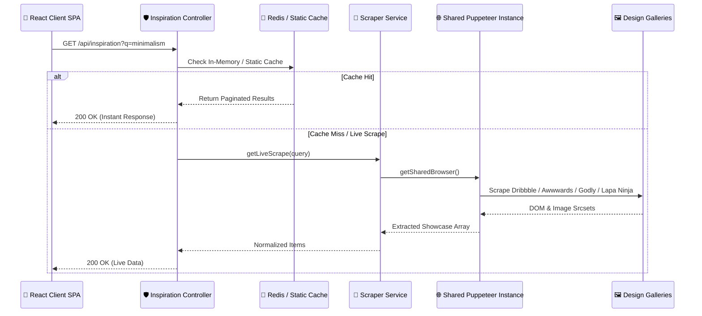

# 🎨 Design Inspiration Aggregation Service Architecture

Zync features an integrated Design Inspiration Search Engine that aggregates real-world UI/UX showcases from premier web design galleries. This service enables developers and designers to research reference interfaces directly inside their project workspace without switching tabs.

This document outlines the scraping architecture, browser virtualization pipeline, and caching strategy, verified 100% accurate against `backend/services/scraperService.js` and `backend/controllers/inspirationController.js`.

---

## 🏗️ System Architecture

---

## 🔍 Supported Target Platforms

The scraping engine is modularized to extract curated design artifacts across five major showcase platforms:

1. **Dribbble (`scrapeDribbble`)**: Intercepts `li.shot-thumbnail` elements, parsing responsive image attributes (`data-srcset`, `srcset`, `data-src`) to extract high-resolution (`400x300`) showcase shots.
2. **Awwwards (`scrapeAwwwards`)**: Scrapes `.card-site` containers, resolving `aria-label` titles and `2x` retina image descriptors from responsive srcsets.
3. **Godly Website (`scrapeGodly`)**: Targets `<article>` tags, extracting background image URLs (`div.bg-cover`) and direct site showcase links.
4. **Lapa Ninja (`scrapeLapaNinja`)**: Navigates instant search queries (`/search/?q=`), extracting `.ais-Hits-item` grids and executing automated window scrolling for pagination.
5. **SiteInspire (`scrapeSiteInspire`)**: Parses `.WebsiteCard` structures to retrieve external portfolio links and showcase captures.

---

## 🌐 Virtualized Browser Engine

Web scraping heavy Javascript galleries requires headless browser automation. To prevent memory exhaustion and CPU bottlenecks on backend Node.js instances, Zync implements a virtualized browser resource pooling strategy:

### Stealth Virtualization
The service utilizes `puppeteer-extra` equipped with `puppeteer-extra-plugin-stealth` (`StealthPlugin`). This masks automated WebDriver signatures, overriding `navigator.webdriver` flags and setting legitimate Windows Chrome User-Agents (`Mozilla/5.0 Chrome/120.0.0.0`) to bypass bot detection challenges (Cloudflare, Akamai).

### Shared Singleton Lifecycle
Launching a new Chromium process per request is computationally prohibitive (~100MB+ RAM per instance). The scraper maintains a singleton shared browser instance (`sharedBrowser`):
* **Connection Reuse**: Requests execute `getSharedBrowser()`, reusing the active Chromium connection across concurrent scrapes.
* **Network Interception**: For galleries like Godly, request interception (`page.setRequestInterception(true)`) aborts non-essential resource downloads (`font`, `stylesheet`, `media`), accelerating DOM readiness.
* **Automated Idle Garbage Collection**: A debounce timer (`scheduleSharedBrowserClose`) monitors browser inactivity. If no scraping requests occur within `SHARED_BROWSER_IDLE_MS` (default: 300,000ms / 5 minutes), `closeSharedBrowser()` safely terminates the Chromium process to free system memory.

---

## 🚀 Caching & Pagination Pipeline

To guarantee sub-100ms API response times for standard user lookups:

1. **Static Pre-Aggregation Fallback**: The controller attempts to load pre-scraped showcase datasets from disk (`backend/data/inspiration.json`).
2. **In-Memory Query Filtering**: Standard queries filter cached datasets across title strings, gallery source identifiers, and associated keyword tags.
3. **Standardized Pagination**: All results pass through `paginateArray(items, req.query)`, returning strict slice boundaries accompanied by standard pagination HTTP headers (`X-Total-Count`, `X-Page`, `X-Per-Page`).
