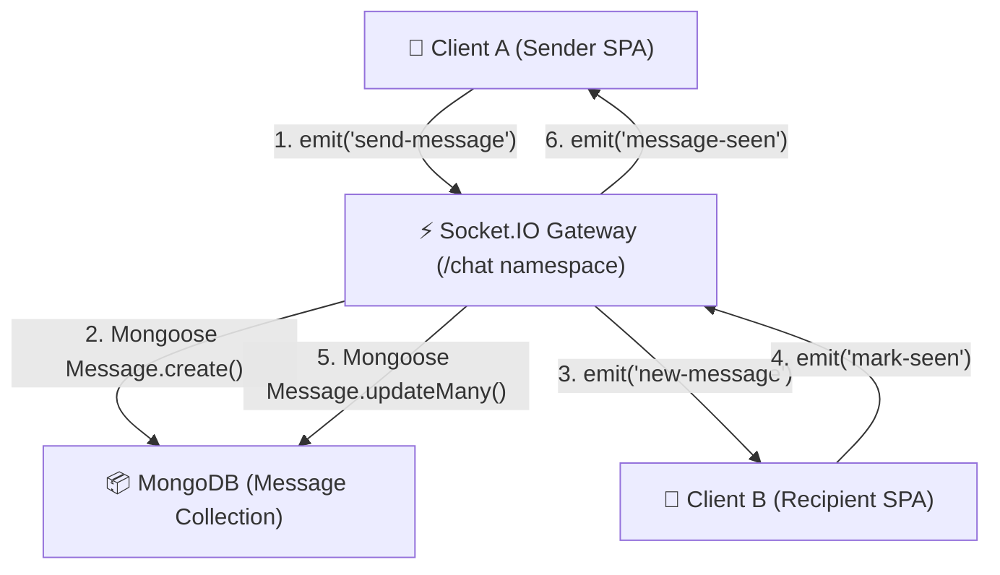

# 💬 Instant Chat Messaging System Architecture

Zync implements a dedicated, high-throughput instant messaging engine designed for real-time team communication, social graphing, and project discussion. Shifting away from third-party BaaS chat quotas, Zync operates a custom persistent messaging layer over Socket.IO backed by MongoDB.

This document details the transport protocol, socket connection tracking, and delivery reliability mechanisms, verified 100% accurate against `backend/sockets/chatSocketHandler.js` and `backend/models/Message.js`.

---

## 🏗️ Architecture & Transport Topology

---

## ⚡ Socket.IO Namespacing & Connection Tracking

All real-time chat traffic is isolated within the dedicated `/chat` WebSocket namespace (`io.of('/chat')`). Decoupling messaging from general collaboration namespaces prevents payload congestion and allows independent horizontal scaling.

### Multi-Tab Socket Registry
Users frequently maintain multiple active browser tabs or devices. The gateway tracks active user connections using an in-memory multi-socket registry (`userSockets = new Map<UserId, Set<SocketId>>`):
* **Handshake Authentication**: Clients establish connection passing their unique identifier in the handshake query (`ws://host/chat?userId=...`). Unauthenticated handshakes are immediately dropped.
* **Socket Multiplexing**: When a user connects from a new tab, `addSocket(userId, socket.id)` appends the socket ID to the user's active connection set.
* **Unified Dispatch**: Outbound events (new messages, read receipts) execute `emitToUser(userId, event, data)`, iterating across all registered sockets for that user (`chatNamespace.to(sid).emit(...)`) to guarantee instantaneous UI synchronization across all active tabs.

---

## 📬 Protocol Event Lifecycle

The chat protocol operates on a bidirectional event-driven lifecycle:

### Outbound Client Events (Ingress)
* **`send-message`**: Client transmits payload `{ senderId, recipientId, content, tempId }`. The server validates database readiness (`isDbReady()`), constructs a new master `Message` document in MongoDB, and acknowledges receipt.
* **`mark-seen`**: Client acknowledges viewing an active conversation `{ senderId, recipientId }`. The server updates all unread messages between the pair (`status: 'seen'`).
* **`clear-chat`**: Executes soft/hard archive purges for conversation histories.
* **`typing`**: Transmits ephemeral typing indicators `{ senderId, recipientId }`.

### Inbound Server Broadcasts (Egress)
* **`new-message`**: Emitted to the recipient containing the persisted MongoDB message object (`_id`, `createdAt`, `content`).
* **`message-delivered`**: Emitted back to the sender confirming successful socket relay.
* **`message-seen`**: Updates conversation UI checkmarks to blue double-ticks.
* **`user-typing`**: Triggers animated typing bubbles on peer client interfaces.

---

## 🛡️ Delivery Reliability & Catchup Engine

Mobile networks and background browser tabs frequently experience dropped WebSocket connections. To guarantee zero message loss during disconnected states:

### Asynchronous Offline Catchup
When a disconnected user reconnects to the `/chat` namespace:
1. **Pending Query**: The server queries MongoDB for all undelivered messages destined for that user (`recipient: userId, status: { $ne: 'seen' }`).
2. **Batched Catchup Relay**: To prevent memory spikes on reconnection after extended offline periods, catchup delivery is throttled. The server dispatches pending messages in configurable batches (`DELIVERY_CATCHUP_BATCH_SIZE`, default: 200 items across `DELIVERY_CATCHUP_MAX_BATCHES`, default: 10 batches).
3. **Receipt Reconciliation**: Upon successful batch transmission, the database marks offline records as delivered, restoring state parity between local client caches and remote storage.
