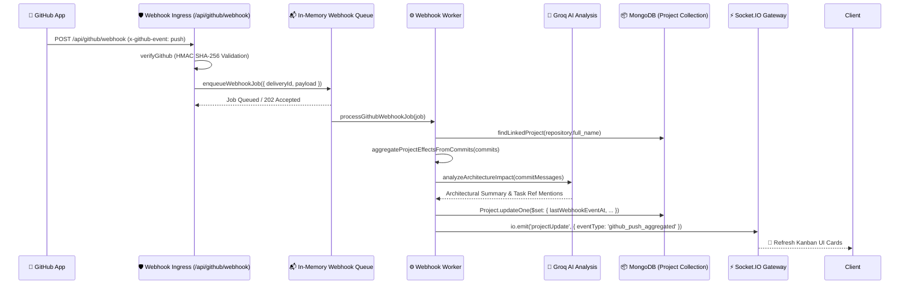

# 📋 Kanban Board & GitHub Webhook Synchronization Architecture

Zync connects project Kanban board tasks directly to Git repository activities. By intercepting GitHub App webhooks and aggregating code commit deltas, Zync automatically correlates repository code pushes to active project workspaces and broadcasts real-time UI updates.

This document details the webhook queuing pipeline, commit impact analysis, and project synchronization lifecycle, verified 100% accurate against `backend/routes/githubAppWebhook.js` and `backend/services/githubWebhookWorker.js`.

---

## 🏗️ Synchronization Pipeline Topology

---

## 🛡️ Ingress Validation & Job Queuing

GitHub App payloads arrive via `POST /api/github/webhook`:
1. **Cryptographic Verification**: The `verifyGithub` middleware validates the `X-Hub-Signature-256` header against the application secret using `crypto.timingSafeEqual()`, dropping unverified or replayed payloads.
2. **Delivery Deduplication**: To handle GitHub's automated webhook retries on timeout, the route extracts `X-GitHub-Delivery`. The `enqueueWebhookJob` service checks active job sets to ensure duplicate delivery IDs are acknowledged (`202 Accepted`) without double-queueing.

---

## ⚙️ Worker Processing & Commit Aggregation

Asynchronous background processing isolates webhook spikes from Express API latency:

### Repository Correlation
The worker inspects the incoming payload's `repository` object (`payload.repository`). It performs a indexed lookup (`findLinkedProject`) across MongoDB `Projects` matching repository URLs or repository full names (`owner/repo`). Unlinked repository events are safely ignored.

### Delta Batch Throttling
To prevent Denial of Service (DoS) during massive force pushes or initial repository imports, commit processing is bounded by free tier safety constants (`DELIVERY_CATCHUP_BATCH_SIZE * DELIVERY_CATCHUP_MAX_BATCHES`, default: 2,000 commits max). Excess commits (`droppedCommits`) are safely truncated while retaining aggregate metadata.

### Architectural Impact Analysis
Commit message arrays are extracted and passed through `analyzeArchitectureImpact`:
* **AI Summarization**: If `GROQ_API_KEY` is configured, Llama 3 inspects the commit delta to generate a high-level natural language summary of architectural modifications.
* **Regex Task Linking**: A fallback regex scanner (`/\b(?:TASK-\d+|ID-\d+|#\d+)\b/i`) tallies direct mentions of project task identifiers across the commit logs.

---

## 📦 State Persisting & WebSocket Broadcast

Upon finalizing commit aggregation:
1. **Master Record Upsert**: The worker executes `Project.updateOne(...)`, recording webhook audit fields (`lastWebhookCommitCount`, `lastWebhookCommitShas`, `lastWebhookChangedFiles`, `lastWebhookPusher`, `lastWebhookAiSummary`).
2. **Real-Time Client Notification**: The worker extracts the global Socket.IO instance (`req.app.get('io')`) and dispatches a global `projectUpdate` broadcast event (`eventType: 'github_push_aggregated'`). Active project interfaces instantly update Kanban card activity feeds and task completion checkmarks.
