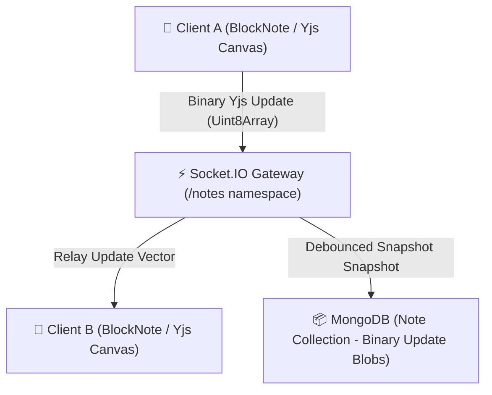

# 📝 Real-Time Collaborative Notes Editor Architecture

Zync provides an enterprise-grade collaborative authoring workspace that allows software teams to draft technical documentation, meeting minutes, and architectural specs simultaneously. The editor achieves conflict-free real-time synchronization with sub-50ms latency using Conflict-free Replicated Data Types (CRDTs).

This document details the CRDT transport pipeline, WebSocket namespacing, presence tracking, and local-first persistence, verified 100% accurate against `backend/sockets/noteSocketHandler.js` and frontend BlockNote implementations.

---

## 🏗️ Collaboration Topology

---

## 🧠 CRDT Engine & Local-First State

Traditional operational transformation (OT) collaborative editors rely on central server locking to resolve concurrent edits. Zync implements a decentralized local-first architecture powered by **Yjs**:

### Conflict-Free Replicated Data Types (CRDTs)
* **Local Authoring**: Edits made inside the rich text canvas (`@blocknote/react`) instantly mutate the local Yjs document (`Y.Doc`) in memory. The UI updates synchronously with zero network blocking.
* **Offline IndexedDB Caching**: Through `y-indexeddb` and Dexie, local Yjs document vectors are constantly mirrored to the browser's IndexedDB. If a user loses internet connectivity, they continue editing seamlessly. Upon reconnection, update vectors merge automatically without data loss.

---

## ⚡ Transport Gateway & Presence Orchestration

Collaborative transport is hosted within the dedicated `/notes` Socket.IO namespace (`io.of('/notes')`). 

### Room Joining & Metadata Handshake
When a user opens a document canvas, the client emits `join_note` providing metadata `{ noteId, userId, userName, userAvatar, userColor }`:
1. **Room Allocation**: The socket joins the dedicated document room (`socket.join(noteId)`).
2. **Presence Map**: The backend tracks active collaborators in an in-memory two-dimensional registry (`notePresence = new Map<NoteId, Map<UserId, PresenceMetadata>>`).
3. **Cursor & Selection Broadcasting**: The gateway dispatches `presence_update` broadcasts to all active peers in the document room. Clients render real-time colored awareness carets (`#3b82f6` or custom user hexes) accompanied by floating author name tags.

### Binary State Relay
Unlike JSON REST APIs, CRDT synchronization exchanges compact binary update vectors:
* **Raw Transport**: When a local document mutates, Yjs encodes the delta into a compressed `Uint8Array`. The client transmits this raw buffer over WebSocket (`socket.emit('yjs-update', updateBuffer)`).
* **Zero-Decoding Relay**: To maximize Node.js event loop throughput, the `/notes` handler bypasses JSON serialization or delta inspection. The server broadcasts raw binary blobs directly to peer sockets in the room (`socket.to(noteId).emit('yjs-update', buffer)`).

---

## 📦 Asynchronous Database Persistence

Persisting high-frequency CRDT keystrokes directly to MongoDB on every packet would overwhelm database write I/O. Zync implements a debounced persistence strategy:
1. **In-Memory Accumulation**: The server accumulates binary document state vectors in memory while active editing sessions are underway.
2. **Debounced Commit**: When document mutations settle (or upon active room disconnection), backend worker threads encode the consolidated Yjs binary state into a master update blob.
3. **MongoDB Capped Upsert**: The binary payload is persisted to MongoDB (`Notes` collection), ensuring that newly joining clients or fresh sessions can reconstruct the exact document hierarchy instantaneously.
